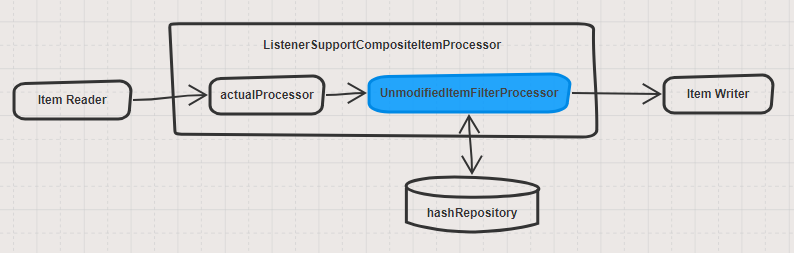
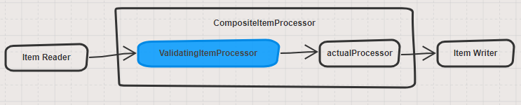

# naver spring batch extension
> spring batch 확장 모듈

* dependency

```xml
<dependency>
    <groupId>com.naver.spring.batch</groupId>
    <artifactId>naver-spring-batch-extension</artifactId>
    <version>0.1.0-SNAPSHOT</version>
</dependency>
```

## 1. AbstractAsyncRestItemReader

> 파라미터를 통해 페이징 처리된 Rest API 에 대해 여러 페이지를 비동기적 으로 요청하여 처리할 수 있도록 기능을 제공

```java
public class SampleRestItemReader extends AbstractAsyncRestItemReader<User> {
    @Override
    protected List<User> convertResponse(ResponseEntity<String> responseEntity, Map<String, ?> uriVariable) {
        
        if (responseEntity != null && responseEntity.getStatusCode() == HttpStatus.OK) {
            String body = responseEntity.getBody();
            // parse to List
        }
        
        return null;
    }
}

```

## 2. SimpleBeanJdbcPagingItemReader

> JdbcPagingItemReader 와 비슷하게 동작 하지만 paging query 를 Bean 객체를 기반으로 자동 생성하여 처리한다.

```java
public class User {
  int id;
  String username;
  int age;
}
```
```xml
<!--JdbcPagingItemReader-->

<bean id="jdbcPagingItemReader" class="org.springframework.batch.item.database.JdbcPagingItemReader" scope="step">
    <property name="dataSource" ref="dataSource" />
    <property name="queryProvider">
        <bean class="org.springframework.batch.item.database.support.SqlPagingQueryProviderFactoryBean">
            <property name="dataSource" ref="dataSource" />
            <property name="selectClause" value="select id, username, age" />
            <property name="fromClause" value="from users" />
            <property name="sortKey" value="id" />
        </bean>
    </property>
    <property name="rowMapper">
        <bean class="...UserRowMapper" />
    </property>
</bean>

<!--SimpleBeanJdbcPagingItemReader-->

<bean id="simpleBeanJdbcPagingItemReader" class="com.naver.spring.batch.extension.item.database.SimpleBeanJdbcPagingItemReader" scope="step">
    <constructor-arg value="User"/>
    <property name="dataSource" ref="dataSource" />
    <property name="sortKey" value="id" />
</bean>

```


## 3. UnmodifiedItemFilterProcessor

> Processor Chain 에 추가되며 처리되는 Item 에 대해 변경 여부를 체크하고 이전에 처리된 Item 에서 변경되지 않았다면 필터 처리한다.


* 변경 여부 판단
  * HashUnmodifiedItemChecker
    * 처리되는 모든 Item 에 대해 message digest 값을 구하여 hash repository 에 저장한다.
    * 이후 처리시 해당 Item 에 대해 hash(message digest) 값을 구하고, 이전에 저장된 값과 비교하여 다른 경우에만 Writer 로 보낸다.
    * message digest 는 [MessageDigest](https://docs.oracle.com/javase/7/docs/api/java/security/MessageDigest.html) 가 지원하는 모든 알고리즘 사용 가능. 기본값 MD5.
    * 저장된 hash 값 유효기간 설정 가능. 기본값(100년)



* HashUnmodifiedItemChecker 에서 JdbcHashRepository 를 사용하고자 할 경우에는 스키마 적용이 필요하다.
  * h2 : hash-schema-h2.sql (naver-spring-batch-extension/src/main/resources/com.naver.spring.batch.extension)
  * mysql : hash-schema-mysql.sql (naver-spring-batch-extension/src/main/resources/com.naver.spring.batch.extension)

* Spring batch Processor 체인에 UnmodifiedItemFilterProcessor 연결 방법

```xml
<bean id="processorChain" class="com.naver.spring.batch.extension.item.ListenerSupportCompositeItemProcessor">
    <property name="delegates">
        <list>
            <ref bean="actualProcessor"/>
            <ref bean="unmodifiedFilter"/>
        </list>
    </property>
</bean>

<bean id="unmodifiedFilter" class="com.naver.spring.batch.extension.item.filter.UnmodifiedItemFilterProcessor" scope="step">
    <property name="checker">
        <bean class="com.naver.spring.batch.extension.item.filter.HashUnmodifiedItemChecker">
            <property name="hashRepository" ref="jdbcHashRepository"/>
            <property name="keyPropertyNames">
                <list>
                    <value>id</value>
                </list>
            </property>
        </bean>
    </property>
</bean>
```

## 4. URL Exist Validation

> Spring Bean Validation 을 활용하여 URL 이 유효한지를 체크한다. 동작 원리는 해당 URL 에 HEAD request 를 호출하여 200 OK 를 확인한다.

```java
public class Sample {
    private int id;
    
    @UrlExists
    private String homepageUrl;
}
```


* Spring batch Processor 체인에 ValidatingItemProcessor 연결 방법



```xml
<bean id="processorChain" class="org.springframework.batch.item.support.CompositeItemProcessor">
    <property name="delegates">
        <list>
            <ref bean="validatingItemProcessor"/>
            <ref bean="actualProcessor"/>
        </list>
    </property>
</bean>
    
<bean id="validatingItemProcessor" class="org.springframework.batch.item.validator.ValidatingItemProcessor">
    <property name="validator">
        <bean class="org.springframework.batch.item.validator.SpringValidator">
            <property name="validator">
                <bean class="org.springframework.validation.beanvalidation.LocalValidatorFactoryBean"/>
            </property>
        </bean>
    </property>
</bean>
```